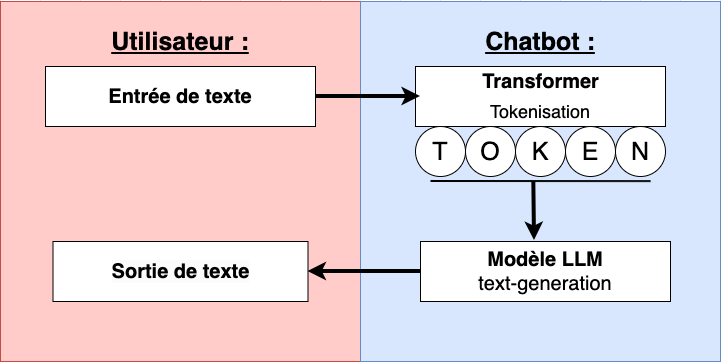
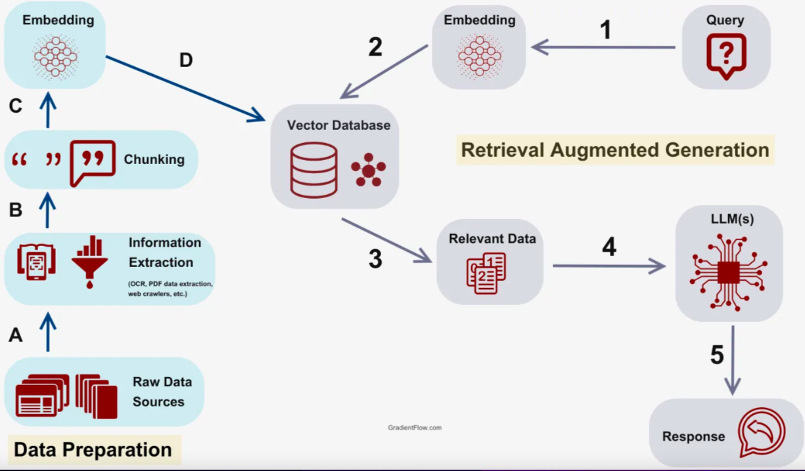
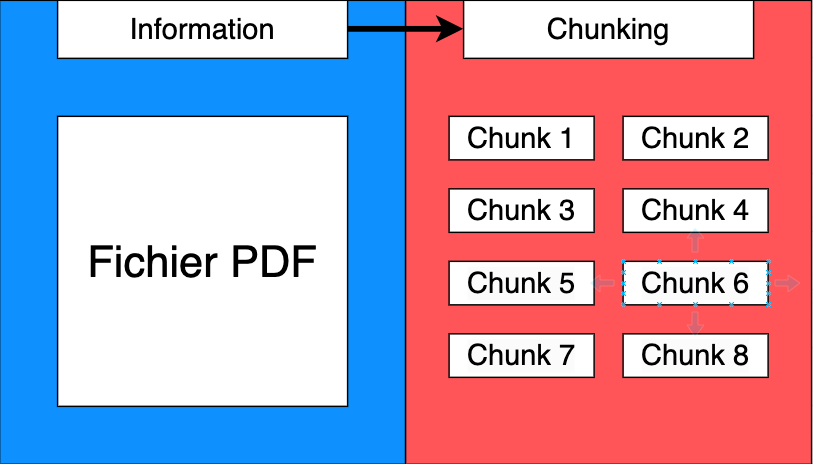
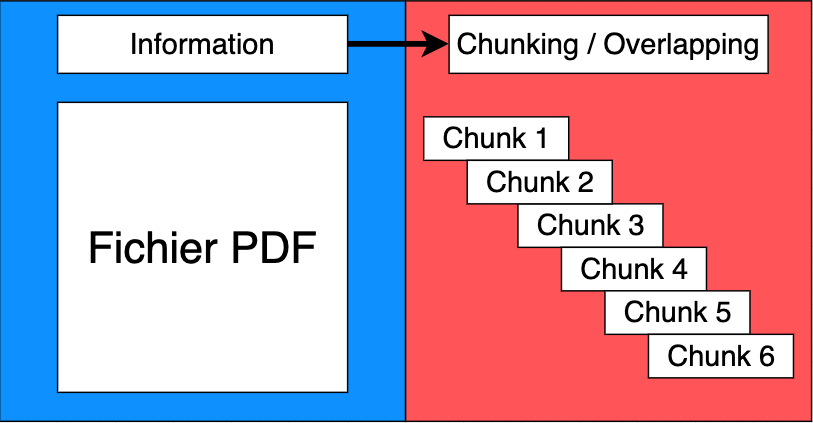

# Site Multilingue

Objectif : Créer un site **Django** simple et **multilingue**, avec des **applications LLM**.

Voici une application **Django** codé en : **Python 3.11.8, HTML, CSS et Javascript**. Environnement de travail : **MacBookAir**. Environnement de déploiement **linux** sur **digitalOcean**, 4Go et 1CPU partagé. Prévoir pour ce projet 8Go et un cpu.

## 1. Installation et Configuration de Django :

Pour ce projet la version **Python 3.11.8** est utilisée, et la version **Django 5.0.6.**

- Récupération par clone du projet:

		git clone https://github.com/Boudjidj-Bilal/DiotSiaci.git

- Création puis activation d'un **virtuel environnement Python**:

		python -m venv nom_virtuel_environnement

- Activation sous **Linux**: 

		source nom_virtuel_environnement/bin/activate.bat
		
- Activation sous **Windows**:

		nom_virtuel_environnement/Script/activate.bat

- Installation des packages **Python** nécessaires au fonctionnement de l'application:

		pip install requirements.txt

- Se positionner à la racine du projet. Lancement de la base de données Vectorielle Chromadb (Prerquis virtuel environnement actif):

		chroma run --host localhost --port 8001 --path ./my_chroma_data

- Lancement de l'application, se positionner à la racine du projet dans un invite de commande et lancer la commande : 

		python manage.py runserver

## 2. Modèles et Vue de Base :

Création d'un modèle(bdd) et des vues pour la gestion et l'affichage des articles.

- Création du modèle.

Le modèle contient une table **article** avec les champs : **title**, **content** et **publication_date**.

- Création de la view principale qui affiche une liste d'articles dans l'app **main** appelée **mainViews** qui redirige vers la page principale **main.html**.

- Création d'une view qui affiche le détail des articles dans l'app **main** appelée **article** qui redirige vers la page principal **article.html**.

- Les pages html sont organisées autour d'une seule page nommée **base.html.** Cette page contient le **menu** est le **footer**. La page base.html est étendue sur les autres pages de notre application grâce à la balise :

		

## 3. Internationalisation (i18n)

À l'aide de **ChatGPT**, j'ai pu voir l'**internationalisation** d'une application **Django**. Dans le cadre de notre application, la langue par défaut sera le Français, et la traduction se fera en Anglais.

### 3.1 Configuration du fichier settings:

Langue par défaut du site :

		LANGUAGE_CODE = 'en-us'

Fuseau horaire par défaut :

		TIME_ZONE = 'UTC'

Activer la gestion des traductions :

		USE_I18N = True

Activer la localisation des formats :

		USE_L10N = True

Activer la gestion des fuseaux horaires :

		USE_TZ = True

Liste des langues supportées par votre application :

		LANGUAGES = [ ('en', 'English'), ('fr', 'Français'), ]

Chemin vers les fichiers de traduction :

		LOCALE_PATHS = [ os.path.join(BASE_DIR, 'locale'), ]

Dans la section **MIDDLEWARE** du fichier de configuration **settings.py**, ajouter après la ligne du **SessionMiddleware**, le **LocaleMiddleware**:

		'django.middleware.locale.LocaleMiddleware',

### 3.2 Traduire les éléments textuels statiques des pages html 

Les pages templates contenants les balises **trans** ou **blocktrans** de **django** doivent charger le module **i18n** en entête de page:

		

Les **éléments textuels statiques** à traduire s'effectuent à l'aide de deux balises **Django**: 

- La balise **trans**, dans le cas d'une seule ligne de texte :  

		


- Le **block trans**, dans le cas de n lignes de textes:

		 This string is translatable and can include variables like {{ value }}. 

La commande **python manage.py makemmessages** permet de collecter l'ensemble des éléments textuels à traduires figurant dans les balises **trans/blocktrans** puis les positionnes dans le fichier **locale/fr/LC_MESSAGES/django.po** en précisant la langue de traduction. toutes mises à jours des éléments textuels au sein du projet nécessitera de relancer cette commande:

		python manage.py makemessages -l en

En cas d'erreur, prévoir l'installation de la librairie GNU gettext.  
  
Editer le fichier **locale/fr/LC_MESSAGES/django.po** en fournissant la traduction dans la langue de destination (exemple: anglais):

		#: templates/mytemplate.html:2

		msgid "Bienvenue sur mon site"  

		msgstr "Welcome to my site."

La commande **python manage.py compilemessages** extrait du fichiers **locale/fr/LC_MESSAGES/django.po** toutes les paires **msgid** et **msgstr** pour les compiler  au sein du fichier binaire **django.mo**.

		python manage.py compilemessages

L'interface utilisateur fourni le changement de langue simplement grâce à deux boutons dans le menu qui mènent tous deux vers la view **change_language**. Celle-ci permet de changer la langue du système en fonction de la langue qu'elle prend en paramètre.  
  
Pour des soucis de simplicités, les **textes dynamiques** n'ont pas été traduit dans chaque langue voulue. Cela aurait été facilement faisable en utilisant des librairies de traductions de textes telle que **google translate** ou encore **chatgpt**.

## 4. Utilisation d'un Modèle de Langage (LLM).

Les grands modèles de langage **LLM (Large Language Model)** sont des modèles d'apprentissages automatiques capable de comprendre et de générer des textes en langage humaine. Ils fonctionnent en analysant des ensembles de données linguistiques massives.  

Ce modèle de language LLM nous permettra par la suite de créer un **chatbot**. Un **chatbot** est un programme qui prend une saisie de texte en entrée et qui renvoie une sortie de texte correspondante.

### 4.1 schéma du fonctionnement du chatbot :

Pour ce **chatbot**, je me suis inspiré de cette [documentation](https://medium.com/@danushidk507/creating-a-simple-chatbot-with-open-source-llms-using-python-and-hugging-face-01a9f5a7ebdf), ainsi que de **chatgpt**.

Voici un schéma représentant le fonctionnement d'un **chatbot**:

### 4.2 La librairie tranformers de HuggingFace

La librairie **Transformers** de **HuggingFace** permet la gestion facile des chargements de modèles de machine learning ainsi que la **tokenisation** qui est associé au modèle. Chaque modèle de machines learning dispose de sa propre façon de **tokeniser**. La décomposition des mots en **tokens** peut être effectuée par l'extraction de la racine du mot, par syllables, etc.  
  
Le sens symantique de la phrase est conservé durant la phase de **tokenisation**.  

Enfin, on **encode (embedding)** tous les **tokens**, cela de manière à ce que le modèle puisse les comprendre.  

### 4.3 Le modèle (LLM)

Le **transformer** encode la requête d'entrée puis la transmet auprès du modèle de génération de texte pré-entrainé pour inférence. La taille d'entrée des données au modèle est limitée par la taille des données utilisées lors de l'entrainement du modèle.  
  
Par manque de ressources matérielles, et pour des besoins de démonstration simple, le modèle **community/GTP2** est utilisé dans le cadre de ce projet. Modèle entrainé sur un corpus Anglais.

### 4.4 La views

Le fichier **utils.py** contient les fonctions principales que font appelles les views de **Django**.

- Le modèle de **machine learning** et **la tokenisation** qui lui est associée sont chargés en tant que **variables globales**.

		generation_texte = pipeline("text-generation")

- On crée une view nommée **chatbotGpt2** qui recoit la requête entrée par l'utilisateur.

- On récupère le texte. La view effectue la traduction si nécessaire de cette requête en Anglais **Gpt2** pour inférence.  

Librairies de traduction de texte : 

		from deep_translator import GoogleTranslator

		textEntree = GoogleTranslator(source'auto', target=langue).translate(texte)

- On entre le texte traduit dans le modèle pus on récupère la réponse en sortie (l'étape de la **tokenisation** se fait automatiquement dans cette fonction).

		result = generation_texte(textEntree)

		texteSortie = result[0]["generation_text"]

- Enfin on retraduit le texte dans la langue de l'utilisateur, en fonction de la langue de l'application. Puis on retourne le résultat.

### 4.5 l'interface

L'application a été conçue pour ne pas stocker les données textuelles du **chatbot**, par conséquent, il n'y a pas de persistance des données.  

Pour faire simple, l'historique de la conversation est conservé sur la page web sans rafraichissement de la page au moyen de **requêtes Ajax** vers la view **Django**.

## 5 Chatbot avec le RAG

Le **RAG (Retrieval-Augmented Generation)** consiste à utiliser un **modèle (LLM)** pré-entrainé de génération de textes comme vue dans la partie 4, de façon à ce qu'il utilise **uniquement** nos données comme contexte de travail (exemple :données d'entreprise) en vue de répondre à la question voulue. On lui proscrit de répondre en dehors de notre contexte. Le **RAG** permet d'éviter les **hallucinations** (réponses hors sujet du chatbot).

### 5.1 schéma du fonctionnement du RAG :

Pour le **RAG** j'ai suivis cette [documentation](https://medium.com/enterprise-rag/an-introduction-to-rag-and-simple-complex-rag-9c3aa9bd017b), ansi que celle-ci :[documentation2](https://reglo.ai/les-composants-du-processus-de-rag/).  (`changer en: j'ai suivis ces documentations  : lien1, lien2)

**Workflow RAG**  

### 5.2 Base de données vectorielles : Data Preparation :
Cette étape consiste à préparer la base de données **vectorielles** pour le bon fonctionnement du **RAG**. Elle herbergera l'ensemble de nos documents qui ont été découpés en **chunks**, puis **embedded** par un modèle de machine learning dédié à cet effet.

- **Préparation des données : Raw data source** (**Workflow RAG**)

On récupère tout d'abord les données pertinentes dans le cadre du **RAG** (exemple : fichier pdf). Pour simplifier le fonctionnement de l'application. Ces données doivent être en anglais afin que le modèle puisse les comprendre. Dans le cadre de cette application, les fichiers précédemment téléversés seront supprimés automatiquement pour des phases de test dans le rag pour des besoins de teste.

- **Filtrage des données : Information Extraction** (**Workflow RAG étape A**)

On récupère les données des fichiers entrés (exemple : pdf) et on extrait les informations voulues (texte).  
Ces informations constituent le contexte dans lequel le modèle **LLM** devra s'appuyer pour sa réponse en fonction de la question posée.  

- **Chunking :**  (**Workflow RAG étape B**)

Le **chunking** est l'opération qui consiste à découper un document en plusieurs partie de taille fixe. Ces même parties sont appelés des **chunks**.  Il y a plusieurs manières pour faire un **chunking**. Par exemple si un fichier Pdf possède 200 pages, le **chunking** va découper ces 200 pages en 200 **chunks** différents. Ces 200 **chunks** réunis formeront le contenu complet du fichier Pdf.  
  
Dans le cadre de ce projet, le modèle d'embedding **"all-MiniLM-L6-v2"** utilise des **chunks** d'une longueur de 256 mots. Soit environ une demi-page.

Le découpage en **chunk** peut induire une perte de contexte de l'information.  
Pour palier à cette possible perte d'information, il faut paramétrer l'opération de **chunking(le découpage)** en sorte que la fin et le début des **chunks** se chevauchent entre eux. On appelle cela, de l'**Overlapping**. Cela nous permet d'éviter qu'un contexte se trouve à cheval entre deux **chunks**. Il s'agit d'une fenêtre glissante.  

- **Encodage : Embedding** (**Workflow RAG étape C**)

Pour l'étape de **l'embedding (encodage)**, j'ai suivis cette documentation : [documentation](https://sbert.net/docs/installation.html).   

La phase d'**embedding** requière un modèle de **machine learning** d'**embedding** entrainé pour analyser efficacement la symantique du texte. Les modèles d'**embedding** sont particulierement adapté à la **recheche de similarité** d'un texte. 

- **Sauvegarde** (**Workflow RAG étape D**)

Sauvegarde de tous les **chunks encoder(embedded)** dans la base de données **vectorielles (chromadb)**. Les attributs des champs encodés sont de type **BLOB**. Il y a aussi les champs **id, chunks** et **la requête originale**. 

### 5.3 Requête client : RAG

- **Requête du client** (**Workflow RAG**)

Récupération de la question que l'utilisateur à entrée dans le **chatbot**. Si la question n'est pas en anglais, elle est alors traduite en anglais pour que le modèle puisse comprendre. Etape non nécessaire si le modèle de machine learing utlisé supporte le multilingue.

- **Encodage : Embedding** (**Workflow RAG étape 1**)

**Encodage(Embed)** de la question avec le même encodage utilisé précédemment. 

- **Interroge la bdd vectorielles** (**Workflow RAG étape 2**)

Requête vers la base de données **vectorielles** afin de rechercher **la similarité** entre les **chunks encodés(embedded)** et **la question encodée(embedded)**.  
Pour faire la comparaison, le modèle peut utiliser différentes fonctions de recherche par similarité. Par exemple la fonction de **cosinus similarité**, elle est utilisée par défaut dans le modèle de notre application. Cette fonction comparera la question et les **chunks**(informations découpées du contexte) afin de récupérer les **chunks** les plus pertinents par rapport à la question.  

- **Décodage des données** (**Workflow RAG étape 3**)  

Décodage de tous les chunks renvoyés, ils formeront le contexte mis en paramètre du modèle, et on récupère la question originale non encodé.

- **Formation du prompt**

Le prompt représente toutes les données entrées dans le modèle en paramètre (le contexte et la question).

- **Envoie des informations au modèle** (**Workflow RAG étape 4**)

Tokenisation et envoie des informations au modèle de génération de texte LLM. (voir le grand 4 pour comprendre la tokenisation). Modèle Gpt2 utilisée par défaut dans ce projet.

- **Réponse du modèle** (**Workflow RAG étape 5**)

On récupère la réponse du modèle puis on la transmet à l'utilisateur. On traduit si besoin la réponse dans la langue de l'utilisateur.

### 5.4 la Views

On utilise ici un fichier **utils.py**, la views pourra faire appel à toutes les fonctions se trouvant dans ce fichier.

- On importe en **variables globales le modèle LLM** ainsi que **le modèle d'embedding**.
Chargement du **modèle de génération de textes** :

		model_name = "openai-community/gpt2"

		model = GPT2LMHeadModel.from_pretrained(model_name)
		tokenizer = GPT2Tokenizer.from_pretrained(model_name)

Chargement du **modèle d'embedding (encodage)** :

		model_embedding = "sentence-transformers/all-MiniLM-L6-v2"
		embedding_model = SentenceTransformer(model_embedding)
		embedding_function = SentenceTransformerEmbeddings(model_name=model_embedding)

Chargement de la **base de données vectorielles Chroma**:

		from chromadb.config import Settings
		localhost = 'localhost'
		port = '8001'
		chroma_client = chromadb.HttpClient(host=localhost, port=port, settings=Settings())

- Récupération des fichiers : **Data Preparation** :
La récupération des fichiers s'effectue dans la fonction **upload_files** se trouvant dans la view.  
  
Tout d'abord, elle vérifie l'extentions des fichiers entrée dans le formulaire. Seuls les fichiers pdf et txt sont accéptés dans le cadre de notre projet.  
  
Puis elle enregistre les fichiers dans le répertoire uploads à la racine du projet.  
On fait ensuite appel à la fonction **vectorDocuments**. Elle prend en paramètre les fichiers et retourne une liste de tout les **chunks**. Les fichiers sont découpés en plusieurs **chunks** de cette manière:

		chunk_size = 256  ( `attention : c'est 256`)
		chunk_overlap = 20 
		text_splitter = RecursiveCharacterTextSplitter(chunk_size=chunk_size, chunk_overlap=chunk_overlap)
        chunks = text_splitter.split_documents(document)
        chunked_documents.extend(chunks)

Ensuite la fonction **upload_files** fait appel à la fonction **addDocumentDB**. Celle-ci ajoute la liste des chunks dans **la base de données vectorielles ChromaDB**

- Requête client : **RAG** :
La gestion des interactions avec le chatbot s'effectue dans la fonction **chatbotRag** se trouvant dans la view. La **persistance des données** n'étant pas implémentée dans cette application, les requêtes du **chatbot** se font via des requêtes **Javascript** afin que le fil de la conversation reste sur la page sans l'actualiser.

Dans cette fonction on récupère la question de l'utilisateur. On la traduit en anglais si besoin. Puis on fait appel à la fonction **process_query** qui va traiter la requête de l'utilisateur et retourner une réponse.  
  
On fait la **recherche de similarité** grâce à la fonction : **searchSimilarity** qui prend en paramètre la question de l'utilisateur.  
  
Puis on génère une réponse grâce à la fonction **gradGeneration** qui prend en paramètre le contexte trouvé par la recherche de similarité et la question de l'utilisateur.  

## 6 Design de l'application

Le **design** de l'application a était fait de manière très simple à l'aide de **Bootstrap**. Et quelques éléments ont été améliorés avec du **CSS** pur, stocké dans un fichier **style.css**.

