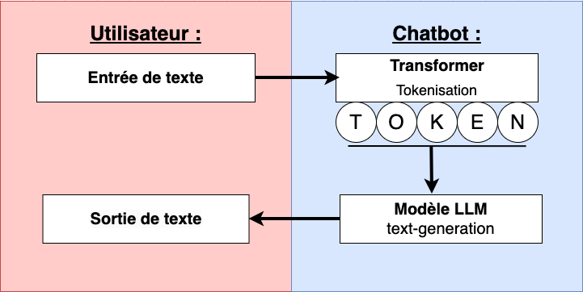
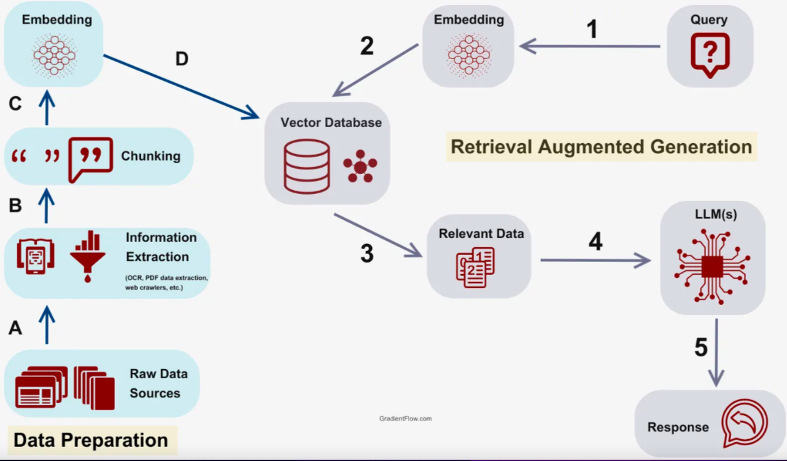
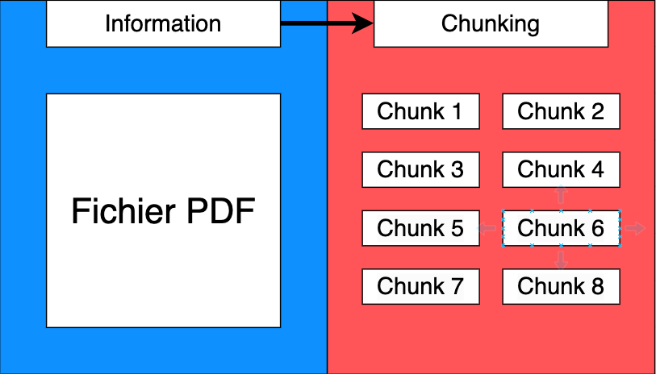

# Site Multilingue

Objectif : Créer un site **Django** simple et **multilingue**, avec éventuellement des **applications LLM**.

Voici une application **Django** codé en : **Python 3.11.8, HTML, CSS et Javascript**. Environnement de travail : **MacBookAir**.

## 1. Installation et Configuration de Django :

Pour ce projet la version **Python 3.11.8** est utilisée, et la version **Django 5.0.6.**

- Récupération du projet:

		git clone https://github.com/Boudjidj-Bilal/DiotSiaci.git

- Création d'un virtuel environnement Python:

		python -m venv nom_virtuel_environnement

- Installation de tous les autres packages nécessaires au fonctionnement de l'application:

		pip install requirements.txt

- Se placer à la racine du projet. Lancement de la base de données Vectorielle Chromadb :

		chroma run --host localhost --port 8001 --path ./my_chroma_data

- Lancement de l'application, se placer à la racine du projet dans un invite de commande et lancer la commande :

		python manage.py runserver

## 2. Modèles et Vue de Base :

Afin de pouvoir gérer des articles on créer un modèle et une vue pour pouvoir les afficher.

- Création du modèle.

Le modèle contient une table **article** avec les champs : **title**, **content** et **publication_date**.

- Création de la view principale qui affiche une liste d'articles dans l'app **main** appelée **mainViews** qui redirige vers la page principal **main.html**.

- Création d'une view qui affiche le détail des articles dans l'app **main** appelé **article** qui redirige vers la page principal **article.html**.

- Les pages html sont organisées autour d'une seule page nommée **base.html.** Cette page contient le **menu** est le **footer**. La page base.html est étendue sur les autres pages de notre application grâce à la balise :

		

## 3. Internationalisation (i18n)

À l'aide de **ChatGPT**, j'ai pu voir l'internationalisation d'une application Django. Dans le cadre de notre application, la langue par défaut sera le Français, et la traduction se fera en Anglais.

  

### 3.1 Configuration du fichier settings:

Langue par défaut du site :

		LANGUAGE_CODE = 'en-us'

Fuseau horaire par défaut :

		TIME_ZONE = 'UTC'

Activer la gestion des traductions :

		USE_I18N = True

Activer la localisation des formats :

		USE_L10N = True

Activer la gestion des fuseaux horaires :

		USE_TZ = True

Liste des langues supportées par votre application :

		LANGUAGES = [ ('en', 'English'), ('fr', 'Français'), ]

Chemin vers les fichiers de traduction :

		LOCALE_PATHS = [ os.path.join(BASE_DIR, 'locale'), ]

  

Dans le **middleware** du fichier settings.py, implémenter après la ligne du **SessionMiddleware**, le **LocaleMiddleware**:

		'django.middleware.locale.LocaleMiddleware',

### 3.2 Traduire les éléments static des pages html

Tout d'abord il faut loader la balise i18n sur les pages html où on veut traduire du texte, on place cette balise tout en haut de chaque page:

		

Afin de traduire les **éléments static** voulut, on peut place deux types de balise:

- La balise **trans**:

		


- Le **block trans**:

		 This string is translatable and can include variables like {{ value }}. 

Une fois que tous les éléments static du projet on était balisé, à la racine du projet, lancer la commande :

		python manage.py makemessages -l en

Si cette commande ne fonctionne pas. Pensez à installer **GNU gettext** pour lancer la commande **makemessages**.  

Cette commande crée un fichier **django.po** dans le répertoire **locale/fr/LC_MESSAGES/** à la racine du projet. Il faut relancer cette commande dès que l'on rajoute des éléments à traduire.  

Il faut maintenant ouvrir le fichier **django.po** et donner la traduction de chaque texte dans la langue voulue (exemple: anglais):

		#: templates/mytemplate.html:2

		msgid "Ceci est une chaîne de caractères traduisible."

		msgstr "Welcome to my site."

Ensuite lancez la commande :

		python manage.py compilemessages

Elle aura pour fonction de compiler les textes traduits dans le fichier **django.mo**

  

Enfin, nous allons permettre aux utilisateurs de changer la langue simplement grâce à deux boutons dans le menu qui mènent tous deux vers la view **change_language**. Celle-ci permet de changer la langue du système en fonction de la langue qu'elle prend en paramètre.  

Pour des soucis de simplicités, les **textes dynamiques** n'ont pas été traduit dans chaque langue voulue. Cela aurait été facilement faisable en utilisant des librairies de traduction de texte telle que **google translate** ou encore **chatgpt**.

## 4. Utilisation d'un Modèle de Langage (LLM).

Les grands modèles de langage **LLM (Large Language Model)** sont des modèles d'apprentissage automatique capable de comprendre et de générer des textes en langage humain. Ils fonctionnent en analysant des ensembles de données linguistiques massives.  

Ce modèle de language LLM nous permettra par la suite de créer un **chatbot**. Un **chatbot** est un programme qui prend une saisie de texte en entrée et qui renvoie une sortie de texte correspondant.

### 4.1 schéma du fonctionnement du chatbot :

Pour ce **chatbot**, je me suis inspiré de cette [documentation](https://medium.com/@danushidk507/creating-a-simple-chatbot-with-open-source-llms-using-python-and-hugging-face-01a9f5a7ebdf), ainsi que de **chatgpt**.

Voici un schéma représentant le fonctionnement d'un **chatbot**:

### 4.2 Le transformer

Tout d'abord, le **transformer** récupère le texte en entrée et le traite. Il découpe le texte en plusieurs parties appelé des **tokens**. Il y a différentes manières de **tokeniser** un texte. Par exemple, on décompose le texte à la **racine** de chaque mot tel que : manger -> mange / travaillons -> travail / etc.  

On appelle cette étape la **tokenisation**. Lors de la **tokenisation**, l'ordre des **tokens** est conservé.  

Enfin, on **encode (embedding)** tous les **tokens**, cela de manière à ce que le modèle puisse les comprendre.  

### 4.3 Le modèle (LLM)

Le **transformer** envoie les **tokens** au modèle. Le nombre de **token** est limitées par la taille du modèle. Celui-ci est **pré-entrainé** sur des données textuelles massives. Il essaye tout d'abord de comprendre le contexte des **tokens**. Le modèle génère ensuite une sortie qui correspond à une réponse en fonction de ce qu'il a compris.  

Ici le modèle est de type **"texte génération"**. Il utilise par défaut le modèle de **GPT2**. Celui-ci n'est pas très performant et répond que très peu aux attentes. J'utilise ce modèle pour répondre à des questions de coût et de moyen. Si vous possédez un bon budget, que vous possédez une machine puissante et assez d'espace disque. L'idéale serait d'utiliser le modèle **GPT4**, qui est très performant et répond parfaitement aux attentes.  

### 4.4 La views
On utilise ici un fichier utils.py, la views pourra faire appel à toutes les fonctions se trouvant de ce fichier.
- Avant la view du **chatbot**, on appelle en **variable global** le modèle, afin qu'il se lance au démarrage de l'application. Il est ainsi accessible sur nimportequ'elle views de l'app **main**.

		generation_texte = pipeline("text-generation")

**Pipeline** est une commande de **HuggingFace** qui me permet de faire appel au modèle(LLM) de text_generation de GPT2.

- On crée une view nommée **chatbotGpt2** qui reçoit le texte entré par l'utilisateur.

- On récupère le texte puis on le traduit si besoin en Anglais car le modèle **GPT2** ne comprend que l'anglais.  

Librairies de traduction de texte : 

		from deep_translator import GoogleTranslator

		textEntree = GoogleTranslator(source'auto', target=langue).translate(texte)

- On entre le texte traduit dans le modèle pus on récupère la réponse en sortie (l'étape de la **tokenisation** se fait automatiquement dans cette fonction).

		result = generation_texte(textEntree)

		texteSortie = result[0]["generation_text"]

- Enfin on retraduit le texte dans la langue de l'utilisateur, en fonction de la langue de l'application. Puis on retourne le résultat.

### 4.5 l'interface

L'application a été conçue pour ne pas stocker les données textuelles du **chatbot**, par conséquent, il n'y a pas de persistance des données.  

Pour faire simple, on utilise ici des **requêtes Ajax** en **Javascript** pour garder l'historique de la conversation avec le **chatbot** dans la page.  

## 5 Chatbot avec le RAG

Le **RAG (Retrieval-Augmented Generation)** consiste à utiliser un **modèle (LLM)** pré-entrainé de génération de textes comme vue dans la partie 4, de façon à ce qu'il utilise nos données (exemple :données d'entreprise) en vue de répondre à la question voulue. Le **RAG** permet d'éviter les **hallucinations** (réponses hors sujet du chatbot).

### 5.1 schéma du fonctionnement du RAG :

Pour le **RAG** j'ai suivis cette [documentation](https://medium.com/enterprise-rag/an-introduction-to-rag-and-simple-complex-rag-9c3aa9bd017b), ansi que celle-ci :[documentation2](https://reglo.ai/les-composants-du-processus-de-rag/).

### 5.2 Base de données vectorielles : Data Preparation :
Cette étape consiste à préparer la base de données **vectorielles** pour le bon fonctionnement du **RAG**.

- **Préparation des données : Raw data source**

On récupère tout d'abord les données pertinentes dans le cadre du **RAG** (exemple : fichier pdf). Pour simplifier le fonctionnement de l'application. Ces données doivent être en anglais afin que le modèle puisse les comprendre.

- **Filtrage des données : Information Extraction**

On récupère les données des fichiers entrés (exemple : pdf) et on extrait les informations voulues (texte).  
Ces informations constituent le contexte dans lequel le modèle LLM devra s'appuyer pour sa réponse en fonction de la question posée.  

- **Chunking :**  

Le **chunking** c'est une manière de découper les informations textuelles en plusieurs parties. C'est même parties sont appelés des **chunks**.  Il y a plusieurs manières pour faire un **chunking**. Par exemple si un fichier Pdf possède 200 pages, le **chunking** va découper c'est 200 pages en 200 **chunks** différents. Ces 200 **chunks** réunis formeront le contenu complet du fichier Pdf.

Il se peut qu'une information commence dans un **chunk** et finisse dans un autre.
Pour éviter cela, il faut paramétrer le chunking afin que la fin et le début des **chunks** se chevauchent entre eux. On appelle cela, de l'**Overlapping**.

- **Encodage : Embedding**

Pour l'étape de **l'embedding (encodage)**, j'ai suivis cette documentation : [documentation](https://sbert.net/docs/installation.html).  

Utilisation d'un **modèle d'IA** spécialisé dans l'**encodage** afin d'encoder tous les **chunks**. Ce modèle permet d'ajouter des éléments pertinents au contexte et d'enlever les éléments parasites. L'étape de l'**embedding** nous permettra plus tard de faire **la recherche par similarité**.

- **Sauvegarde**  

Sauvegarde de tous les **chunks encoder(embedded)** dans la base de données **vectorielles (chromadb)**. Les attribus des champs encodés sont de type **BLOB**. Il y a aussi les champs **id, chunks** et **la requête original**.

### 5.3 Requête client : RAG

- **Requête du client**

Récupération de la question que l'utilisateur à entrée dans le **chatbot**. Si la question n'est pas en anglais, alors on la traduit en anglais pour que le modèle puisse comprendre.

- **Encodage : Embedding**

**Encodage(Embed)** de la question avec le même encodage utilisé précédemment. 

- **Interroge la bdd vectorielles**

Requête vers la base de données **vectorielles** afin de comparer les **chunks encodés(embedded)** et **la question encodée(embedded)**.  
Pour faire la comparaison le modèle peut utiliser différentes formules. Par exemple la formule de **cosinus similarité**. Cette formule comparera la question et les **chunks**(informations découpées du contexte) afin de récupérer les **chunks** les plus pertinents par rapport à la question.  
Le nombre de **chunk** récupéré dépend de la taille du texte mis en paramètre du **modèle de génération de textes (LLM)**.  

- **Décodage des données**

Décodage de tous les chunks récupérés, ils formeront le contexte mis en paramètre du modèle, et on récupère la question originale non encodé.

- **Formation du prompte**

Le prompte représente toutes les données entrées dans le modèle en paramètre (le contexte et la question).

- **Envoie des informations au modèle**

Tokenisation et envoie des informations au modèle. (voir le grand 4 pour comprendre la tokenisation).

- **Réponse du modèle**

On récupère la réponse du modèle puis on la transmet à l'utilisateur. On traduit si besoin la réponse dans la langue de l'utilisateur.

### 5.4 la Views

On utilise ici un fichier **utils.py**, la views pourra faire appel à toutes les fonctions se trouvant de ce fichier.
  
to do...

## 6 Design de l'application

Le **design** de l'application était fait de manière très simple à l'aide de **Bootstrap**. Et quelques éléments ont été améliorés avec du **CSS** pur, stocké dans un fichier **style.css**.

  

## To do:

### RAG, en cours...

Il sera disponible le 2 juillet 2024 en après-midi.